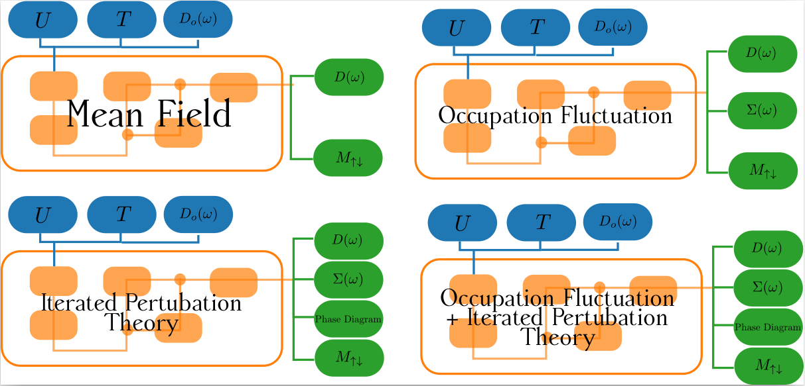

## SKRIPSI S1 MUHAMMAD GAFFAR

#### ABSTRAK
Sistem terkolerasi kuat adalah sistem dimana skala energi untuk interaksi antar partikel tidak lagi dapat diabaikan. \textit{Dynamical Mean Field Theory} menjadi salah satu metode yang banyak dikenal sebagai metode ampuh untuk menjelaskan fisika dari sistem terkolerasi kuat. Disini kami mempelajari metode penyelesaian impuritas yang tersedia di DMFT untuk model Hubbard, model paling sederhana dalam sistem terkolerasi kuat. Dengan melihat berbagai keterbatasan metode penyelesaian impuritas yang memiliki sumberdaya numerik yang murah, kami mengembangkan metode penyelesaian impuritas yang cenderung murah yang dikembangkan dari metode medan rata-rata dengan melibatkan fluktuasi okupansi sebagai kuantitas numerik. Dengan melihat efek fluktuasi, kami membandingkan hasil tersebut dengan metode penyelesaian impuritas murah lainnya, yakni medan rata-rata dan iterasi pertubasi teori yang dipelajari pada keadaan paramagnetik dan antiferomagnetik. Kami simpulkan bahwa fluktuasi okupansi belum sepenuhnya mampu menjadi metode penyelesaian impuritas yang baik, namun cukup menarik untuk digunakan sebagai koreksi dari iterasi pertubasi teori.

#### ALUR PEKERJAAN

#### DOKUMEN SKRIPSI DAN PRESENTASI SIDANG
Dokumen Skripsi (PDF) bisa dilihat . Skripsi belum mengalami revisi finalisasi

Dokumen Presentasi Sidang, bisa dilihat [disini](https://slides.com/mgaffar/efek-fluktuasi-okupansi-pada-model-hubbard-3d-dalam-kerangka-dynamical-mean-field-theory)

#### FOLDER

**doc**: Folder yang memuat pekerjaan dokumen skripsi dalam LateX  
**figures**: Segala gambar yang dimuat dalam dokumen skripsi  
**nb**: Pekerjaan skripsi dalam codingan bahasa pemograman Julia dalam Jupyter Notebook  
**saved_data** = Data perhitungan fase diagram paramagnetik dan antiferomagnetik  
**src**: Fungsi-fungsi matematika yang sering dipakai dalam pekerjaan dalam folder nb  

#### Perhatian
Untuk License, penulis memberikan MIT License untuk seluruh pekerjaannya.
